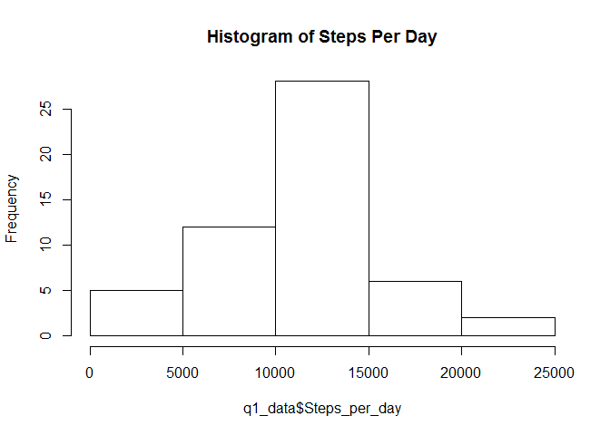
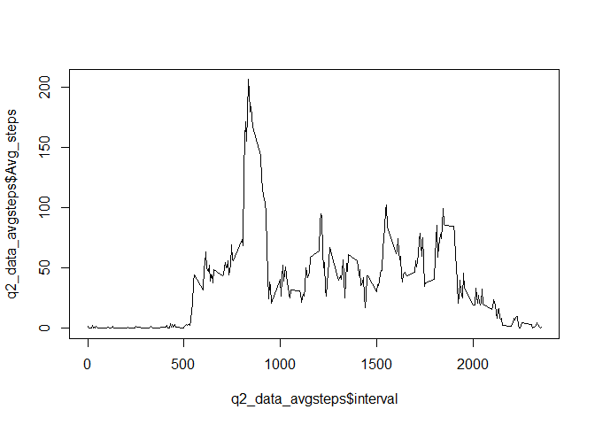
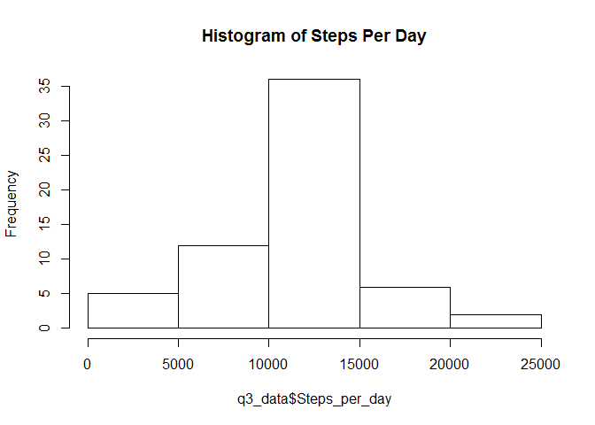
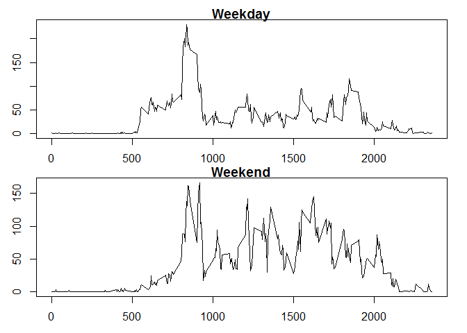

# Reproducible Research: Peer Assessment 1

Produced by: Sukanya Srichandra
Last Update: December 20, 2015

## Loading and preprocessing the data:

Step 1: Unpackaging the ZIP and storing into the data object  

```r
temp<-"activity.zip"
data<-read.csv(unz(temp,"activity.csv"))
```

Step 2: Load plyr package, and summarize data by date into q1_data object. NAs are omitted!


```r
library("plyr")
q1_data <- na.omit(ddply(data,"date",summarize,Steps_per_day=sum(steps)))
```

Step 3: Create the Histogram plot,  - Steps per Day

```r
hist(q1_data$Steps_per_day,main="Histogram of Steps Per Day")
```

 


## What is mean total number of steps taken per day?

```r
mean(q1_data$Steps_per_day)
```

```
## [1] 10766.19
```

##What is the median total number of steps taken per day?

```r
median(q1_data$Steps_per_day)
```

```
## [1] 10765
```


## What is the average daily activity pattern?

Step 1: Set data summary as Q2_data, and compute the average per interval into AvgSteps data object.

```r
q2_data<-na.omit(data)
q2_data_avgsteps<-ddply(q2_data,"interval",summarize,Avg_steps=mean(steps))
```

Step 2: Plot line chart

```r
plot(q2_data_avgsteps$interval,q2_data_avgsteps$Avg_steps,type="l")
```

 

Step 3: Which 5-minute interval, on average across all the days in the dataset, contains the maximum number of steps?

```r
q2_data_avgsteps[which.max(q2_data_avgsteps$Avg_steps),1]
```

```
## [1] 835
```


## Imputing missing values

Step1: Calculate and report the total number of missing values in the dataset (i.e. the total number of rows with NAs)


```r
sum(is.na(data$steps))
```

```
## [1] 2304
```

Step 2: Using the mean for that 5-minute interval, create a new dataset that is equal to the original dataset  
but with the missing data filled in.


```r
        clean_data<-data
        
        navalues<-is.na(clean_data$steps)
        
        mean_interval <- tapply(clean_data$steps, clean_data$interval, mean, na.rm=TRUE, simplify=TRUE)
        
        clean_data$steps[navalues] <- mean_interval[as.character(clean_data$interval[navalues])]
```

Step 3: Make a new histogram of the total number of steps taken each day and Calculate and report the mean and median total  
number of steps taken per day. Do these values differ from the estimates from the first part of the assignment?   
What is the impact of imputing missing data on the estimates of the total daily number of steps?


```r
q3_data <- ddply(clean_data,"date",summarize,Steps_per_day=sum(steps))

#Create the Histogram plot,  - Steps per Day
hist(q3_data$Steps_per_day,main="Histogram of Steps Per Day")
```

 

```r
#Calculate the mean 
mean(q3_data$Steps_per_day)
```

```
## [1] 10766.19
```

```r
#Calculate the median
median(q3_data$Steps_per_day)
```

```
## [1] 10766.19
```


```r
#What is the impact of imputing missing data on the estimates of the total daily number of steps?
print("cleaned data, has same median and mean value now, compared to differing values in the original dataset")
```

```
## [1] "cleaned data, has same median and mean value now, compared to differing values in the original dataset"
```

## Are there differences in activity patterns between weekdays and weekends?
Step 1: Add new columns to delineate Weekends and Weekdays

```r
        #Create a new factor variable in the dataset with two levels 
        #- "weekday" and "weekend" indicating whether a given date is a weekday or weekend day.

        clean_data$Weekday<-weekdays(as.Date(clean_data$date))

        clean_data$Type<-ifelse(clean_data$Weekday=="Saturday","Weekend",ifelse(clean_data$Weekday=="Sunday","Weekend","Weekday"))
```

Step 2: Create subsetted data objects

```r
q4_weekday<-ddply(clean_data[which(clean_data$Type=="Weekday"),],"interval",summarize,Avg_steps=mean(steps))
q4_weekend<-ddply(clean_data[which(clean_data$Type=="Weekend"),],"interval",summarize,Avg_steps=mean(steps))
```

Step 3: Create the panel plots, for the two subsets of data

```r
        #Create Panel - 2 rows and 1 column
        par(mfrow = c(2, 1))

        #Set Margins
        par(mar = c(2, 2, 1, 1), oma = c(0.75, 0.75, 0.5, 0.5))

        #Compile Plots
        plot(q4_weekday$interval,q4_weekday$Avg_steps,type="l",main="Weekday")
        plot(q4_weekend$interval,q4_weekend$Avg_steps,type="l",main="Weekend")
```

 
